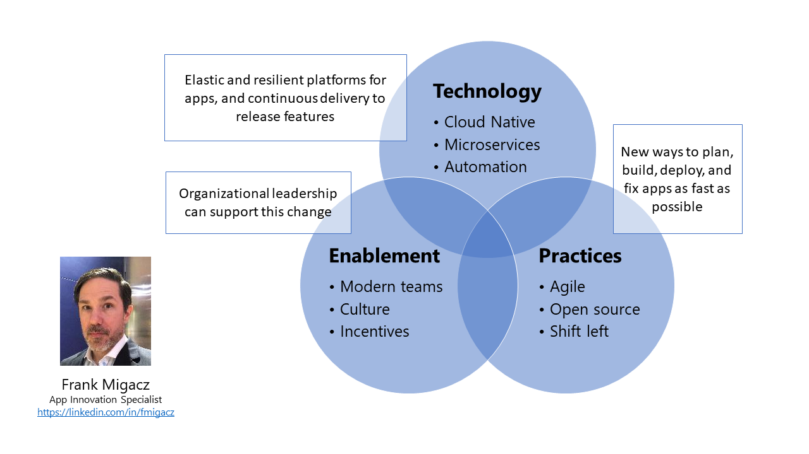

### ¡Hola y bienvenidos! Hei og velkommen!

👷‍♂️ I am an App Innovation Specialist at Microsoft - guiding customers into speeding up the deployment of features and the deployment frequency.

🤠 I'm also currently working on a small team of experts who update the [Azure Architecture Center](https://docs.microsoft.com/en-us/azure/architecture/browse/).

🤖 I collaborate with others on hackathons, and to create demos for work.

💬 Reach me on Twitter [@fmigacz](https://twitter.com/fmigacz)

<!--
**fmigacz/fmigacz** is a ✨ _special_ ✨ repository because its `README.md` (this file) appears on your GitHub profile.

Here are some ideas to get you started:

- 🔭 I’m currently working on ...
- 🌱 I’m currently learning ...
- 👯 I’m looking to collaborate on ...
- 🤔 I’m looking for help with ...
- 💬 Ask me about ...
- 📫 How to reach me: ...
- 😄 Pronouns: ...
- ⚡ Fun fact: ...
-->
